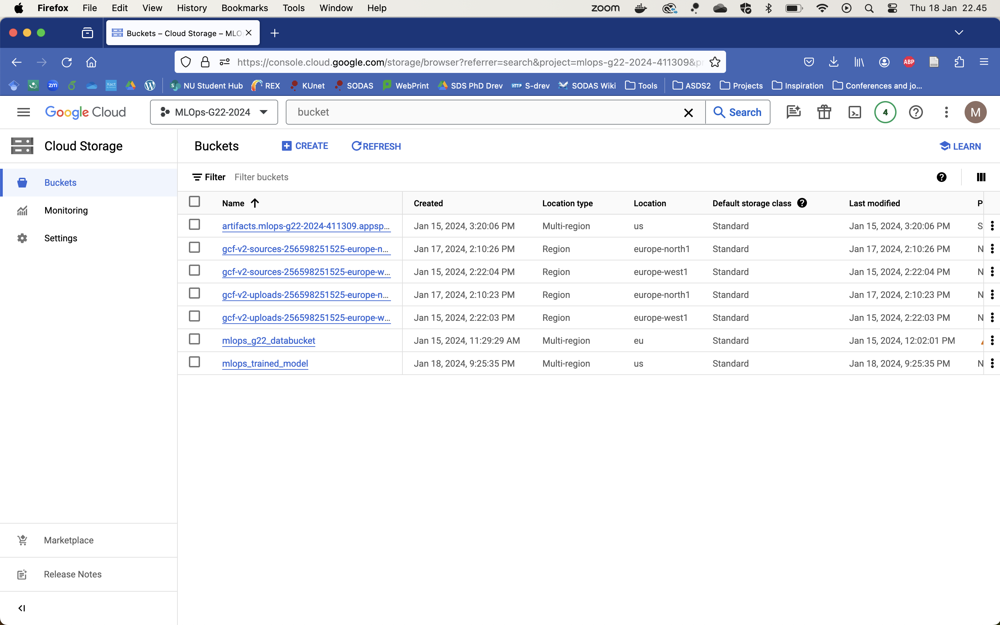

# Exam template for 02476 Machine Learning Operations

This is the report template for the exam. Please only remove the text formatted as with three dashes in front and behind
like:

```--- question 1 fill here ---```

where you instead should add your answers. Any other changes may have unwanted consequences when your report is auto
generated in the end of the course. For questions where you are asked to include images, start by adding the image to
the `figures` subfolder (please only use `.png`, `.jpg` or `.jpeg`) and then add the following code in your answer:

```markdown

```

In addition to this markdown file, we also provide the `report.py` script that provides two utility functions:

Running:

```bash
python report.py html
```

will generate an `.html` page of your report. After deadline for answering this template, we will autoscrape
everything in this `reports` folder and then use this utility to generate an `.html` page that will be your serve
as your final handin.

Running

```bash
python report.py check
```

will check your answers in this template against the constrains listed for each question e.g. is your answer too
short, too long, have you included an image when asked to.

For both functions to work it is important that you do not rename anything. The script have two dependencies that can
be installed with `pip install click markdown`.

## Overall project checklist

The checklist is *exhaustic* which means that it includes everything that you could possible do on the project in
relation the curricilum in this course. Therefore, we do not expect at all that you have checked of all boxes at the
end of the project.

### Week 1

* [ ] Create a git repository
* [ ] Make sure that all team members have write access to the github repository
* [ ] Create a dedicated environment for you project to keep track of your packages
* [ ] Create the initial file structure using cookiecutter
* [ ] Fill out the `make_dataset.py` file such that it downloads whatever data you need and
* [ ] Add a model file and a training script and get that running
* [ ] Remember to fill out the `requirements.txt` file with whatever dependencies that you are using
* [ ] Remember to comply with good coding practices (`pep8`) while doing the project
* [ ] Do a bit of code typing and remember to document essential parts of your code
* [ ] Setup version control for your data or part of your data
* [ ] Construct one or multiple docker files for your code
* [ ] Build the docker files locally and make sure they work as intended
* [ ] Write one or multiple configurations files for your experiments
* [ ] Used Hydra to load the configurations and manage your hyperparameters
* [ ] When you have something that works somewhat, remember at some point to to some profiling and see if
      you can optimize your code
* [ ] Use Weights & Biases to log training progress and other important metrics/artifacts in your code. Additionally,
      consider running a hyperparameter optimization sweep.
* [ ] Use Pytorch-lightning (if applicable) to reduce the amount of boilerplate in your code

### Week 2

* [ ] Write unit tests related to the data part of your code
* [ ] Write unit tests related to model construction and or model training
* [ ] Calculate the coverage.
* [ ] Get some continuous integration running on the github repository
* [ ] Create a data storage in GCP Bucket for you data and preferable link this with your data version control setup
* [ ] Create a trigger workflow for automatically building your docker images
* [ ] Get your model training in GCP using either the Engine or Vertex AI
* [ ] Create a FastAPI application that can do inference using your model
* [ ] If applicable, consider deploying the model locally using torchserve
* [ ] Deploy your model in GCP using either Functions or Run as the backend

### Week 3

* [ ] Check how robust your model is towards data drifting
* [ ] Setup monitoring for the system telemetry of your deployed model
* [ ] Setup monitoring for the performance of your deployed model
* [ ] If applicable, play around with distributed data loading
* [ ] If applicable, play around with distributed model training
* [ ] Play around with quantization, compilation and pruning for you trained models to increase inference speed

### Additional

* [ ] Revisit your initial project description. Did the project turn out as you wanted?
* [ ] Make sure all group members have a understanding about all parts of the project
* [ ] Uploaded all your code to github

## Group information

### Question 1
> **Enter the group number you signed up on <learn.inside.dtu.dk>**
>
> Answer:

22

### Question 2
> **Enter the study number for each member in the group**
>
> Example:
>
> *sXXXXXX, sXXXXXX, sXXXXXX*
>
> Answer:

s232532, s213792, s237246, s173973, s230085

### Question 3
> **What framework did you choose to work with and did it help you complete the project?**
>
> Answer length: 100-200 words.
>
> Example:
> *We used the third-party framework ... in our project. We used functionality ... and functionality ... from the*
> *package to do ... and ... in our project*.
>
> Answer:

For our project, we chose to utilise the Hugging Face Transformers framework along with FastAPI. The Transformers library provided us with a robust and efficient way to use a pre-trained model like DistilBERT for our text classification tasks. This framework significantly helped our development process as it offered pre-trained weights, and tokenizer utilities, which are essential for natural language processing tasks. It eliminated the need for building a model from scratch and allowed us to focus on fine-tuning the model for our specific use case: classifying emotional content in text. 

On the other hand, FastAPI was our choice for creating a web application to serve our model. Its simplicity, speed, and ease of use for building APIs were invaluable, and it was also recommended in the project checklist and lecture materials. It allowed us to quickly set up a RESTful API that could receive text data, process it through our trained model, and return predictions.

## Coding environment

> In the following section we are interested in learning more about you local development environment.

### Question 4

> **Explain how you managed dependencies in your project? Explain the process a new team member would have to go**
> **through to get an exact copy of your environment.**
>
> Answer length: 100-200 words
>
> Example:
> *We used ... for managing our dependencies. The list of dependencies was auto-generated using ... . To get a*
> *complete copy of our development environment, one would have to run the following commands*
>
> Answer:

We have managed dependencies by having two requirements files: one named “requirements.txt” and one “requirements_dev.txt”. The former contains the required libraries and their respective versions for running the code. The latter contains additional libraries which is used in the development and maintenance of the code (e.g. pytest).

To recreate our environment, one could, for instance, create a virtual python environment in conda . Hereafter, the requirements could be installed via pip i.e., “pip install -r requirements.txt” or “requirements_dev.txt”.

We have only listed key dependencies in these files, and not used functionalities such as “pip freeze”, which returns an exhaustive list of the used packages. If harsher requirements were necessary with respect to the reproducibility of our project, this could have been used. However, this was not done due to the limited scope of our project. 

### Question 5

> **We expect that you initialized your project using the cookiecutter template. Explain the overall structure of your**
> **code. Did you fill out every folder or only a subset?**
>
> Answer length: 100-200 words
>
> Example:
> *From the cookiecutter template we have filled out the ... , ... and ... folder. We have removed the ... folder*
> *because we did not use any ... in our project. We have added an ... folder that contains ... for running our*
> *experiments.*
> Answer:

From the cookiecutter template we used all of the folders with the exception of the ‘notebook’ folder, which we deleted. Besides the obvious folders with the python files for creating a dataset, training a model etc., we filled up the outer data folder. In the ‘raw’ file we put in our 3 .txt files (if pulled via dvc the raw folder wil contain training, test and validation datasets) and after processing the data, it is saved in the ‘processed’ folder, from where it is used to train and test our model. 

After training, our model is saved into the outer ‘models’ folder. We also filled out the ‘tests’ and ‘dockerfiles’ as described in the exercises on the course website. In our inner project folder we created an extra folder named: ’wandb’, that is used for our Weights and Bias (wandb) that we use for logging our model. We also added a ‘config’ folder in the inner project folder with a config.yaml file, that we use for hydra in our train_model.py file for writing config files to keep track of hyperparameters.
The rest is self-explanatory, like the inner ‘models’ and ‘data’ folders.

### Question 6

> **Did you implement any rules for code quality and format? Additionally, explain with your own words why these**
> **concepts matters in larger projects.**
>
> Answer length: 50-100 words.
>
> Answer:

Everybody in our project group was responsible for their part of the code or configurations. We generally tried to implement the PEP8 coding practises to ensure our code was not only understandable but also primed for subsequent utilisation.

We wrote a short description in the beginning of the different python files to give the user a quick overview of what our file does. We did something similar with the more complex methods, to make it easier for everybody to understand (also for us in the future). In larger projects, it is important to have code format standards to ensure that other developers and future developers can easily understand and update the code.

## Version control

> In the following section we are interested in how version control was used in your project during development to
> corporate and increase the quality of your code.

### Question 7

> **How many tests did you implement and what are they testing in your code?**
>
> Answer length: 50-100 words.
>
> Example:
> *In total we have implemented X tests. Primarily we are testing ... and ... as these the most critical parts of our*
> *application but also ... .*
>
> Answer:

In total, we have implemented XX tests. 
These tests cover loading the datasets, the text processing and the storage of it. Also, if the processed data can be reloaded and are of appropriate type and dimensions. 

Additionally, we have implemented tests for model training, model loading, and model predictions……


### Question 8

> **What is the total code coverage (in percentage) of your code? If you code had an code coverage of 100% (or close**
> **to), would you still trust it to be error free? Explain you reasoning.**
>
> Answer length: 100-200 words.
>
> Example:
> *The total code coverage of code is X%, which includes all our source code. We are far from 100% coverage of our **
> *code and even if we were then...*
>
> Answer:

The total coverage of our unit tests is XX%. Naturally, 100% would be ideal, but our tests at least cover the main methods of our code and ensure some sanity checks on all of these. Although our tests do not cover the entire code, they will most likely catch any major errors introduced by new changes.

Even if our tests had 100% coverage of our code, this would not be a guarantee of it working as intended under all circumstances. This could, for example, be due to the use of different method arguments, such as using a different dataset. Thus, even with 100% coverage by the unittests, additional tests testing different inputs could still be relevant.

### Question 9

> **Did you workflow include using branches and pull requests? If yes, explain how. If not, explain how branches and**
> **pull request can help improve version control.**
>
> Answer length: 100-200 words.
>
> Example:
> *We made use of both branches and PRs in our project. In our group, each member had an branch that they worked on in*
> *addition to the main branch. To merge code we ...*
>
> Answer:

During the course of our project, we have made use of branches. This has primarily taken the form of having a master and a development branch. For larger additions to the project, we have generally created additional branches on which we made the initial implementation and testing of new features. Afterward, they have been merged into the development branch.

To bring about the merges, we have made pull requests. However, due to the short time frame of the project, we have not enforced strict criteria for approving these code merges. Rather, everyone has had the right to merge without the inclusion of others, ensuring an expedited process. If the project scope had been larger or if more people had been involved, more elaborate merging criteria could have been appropriate.


### Question 10

> **Did you use DVC for managing data in your project? If yes, then how did it improve your project to have version**
> **control of your data. If no, explain a case where it would be beneficial to have version control of your data.**
>
> Answer length: 100-200 words.
>
> Example:
> *We did make use of DVC in the following way: ... . In the end it helped us in ... for controlling ... part of our*
> *pipeline*
>
> Answer:

We implemented DVC in our project to streamline collaboration, ensure reproducibility, and familiarise ourselves with handling large datasets, preparing us for future scalability challenges. By integrating the Google Drive extension with DVC, our team could seamlessly access and share data, significantly enhancing collaborative efficiency. This setup allowed for real-time synchronisation of data changes, ensuring that all team members had access to the latest versions of datasets. 

When we transitioned to a Google Cloud Platform (GCP) environment, we leveraged DVC's capabilities further by using a GCP bucket for data storage. This shift to cloud storage facilitated more robust data handling and version control, especially beneficial for managing larger datasets. The DVC extension for GCP streamlined our workflow by enabling direct data pushes to the cloud, thereby optimising our data storage and access strategy.

### Question 11

> **Discuss you continues integration setup. What kind of CI are you running (unittesting, linting, etc.)? Do you test**
> **multiple operating systems, python version etc. Do you make use of caching? Feel free to insert a link to one of**
> **your github actions workflow.**
>
> Answer length: 200-300 words.
>
> Example:
> *We have organized our CI into 3 separate files: one for doing ..., one for running ... testing and one for running*
> *... . In particular for our ..., we used ... .An example of a triggered workflow can be seen here: <weblink>*
>
> Answer:

The continuous integration (CI) setup implemented in this project is primarily comprised of unittests. These tests have been configured to be executed through GitHub Actions upon code push. To ensure compatibility of our code, the tests are carried out on multiple operating systems, namely Linux, Windows, and macOS (all of the latest versions). The tests are exclusively executed on Python version 3.11, as it is the only relevant version for the scope of this project. If we were to deploy our code and model on a larger scale, with multiple users, it could have been relevant to test the code on multiple Python versions. This could furthermore include testing on different versions of key libraries such as PyTorch and the Transformers framework. Caching has been established on GitHub to store Python libraries (such as PyTorch, NumPy, etc.), aiming to expedite the run time of the unit tests.

Additionally, a limited check of the code is carried out by running the "ruff check" command as a GitHub action. It could have been relevant to enforce stricter practices for formatting of our code and run "rough format" upon push to GitHub. However, due to the limited nature of the project, we decided not to place great emphasis on this.

Two examples of the applied workflow files and the associated executions on GitHub may be found via the links below:

https://github.com/malenehj/MLOps_g22_2024/actions/runs/7543914485/workflow

https://github.com/malenehj/MLOps_g22_2024/actions/runs/7543914477/workflow


## Running code and tracking experiments

> In the following section we are interested in learning more about the experimental setup for running your code and
> especially the reproducibility of your experiments.

### Question 12

> **How did you configure experiments? Did you make use of config files? Explain with coding examples of how you would**
> **run a experiment.**
>
> Answer length: 50-100 words.
>
> Example:
> *We used a simple argparser, that worked in the following way: python my_script.py --lr 1e-3 --batch_size 25*
>
> 
Answer:
We used Hydra and different .yaml config files for our experiments. To integrate it we added the hydra decorator in our train_model.py file that is referencing the main config file. To alter the values before running the experiment one can either change the .yaml file itself or replace them inside the function by calling config.PARAMETER_NAME. This allows to change the hyperparameters from command line by adding them to run command as in the example:

`python train_model.py train.lr = 0.001 train.train_batch_sizes=64`


### Question 13

> **Reproducibility of experiments are important. Related to the last question, how did you secure that no information**
> **is lost when running experiments and that your experiments are reproducible?**
>
> Answer length: 100-200 words.
>
> Example:
> *We made use of config files. Whenever an experiment is run the following happens: ... . To reproduce an experiment*
> *one would have to do ...*
>
> Answer: 

In our methodology, configuration files are key. For every experiment conducted, the used hyperparameters are recorded in a specially designed configuration file for that experiment. This system is anchored by a central file, config.yaml, which links to various experiment-specific config files. When hyperparameters are overridden via command line, we ensure no data is lost by employing the WandB API. This API effectively captures all hyperparameters and other vital metrics for each experiment. Replicating an experiment is straightforward: one needs to select the appropriate .yaml file and integrate it using the hydra decorator in this manner: @hydra.main(config_path="../config", config_name="SELECTED_EXPERIMENT_FILE.yaml"). The file structure of our config files is as follows:

### Question 14

> **Upload 1 to 3 screenshots that show the experiments that you have done in W&B (or another experiment tracking**
> **service of your choice). This may include loss graphs, logged images, hyperparameter sweeps etc. You can take**
> **inspiration from [this figure](figures/wandb.png). Explain what metrics you are tracking and why they are**
> **important.**

>
> Answer length: 200-300 words + 1 to 3 screenshots.
>
> Example:
> *As seen in the first image when have tracked ... and ... which both inform us about ... in our experiments.*
> *As seen in the second image we are also tracking ... and ...*
>
> Answer:

Our project aimed for multiclass text classification, we monitored a variety of metrics to optimize model performance and resource utilization. We focused on tracking  learning rate and loss for training and accuracy and loss in evaluation. The training loss, is crucial as it quantifies the difference between the predicted and actual class labels, guiding the optimization process towards higher accuracy.Additionaly we tracked some system metrics to better understand the hardware performance throughout our experiments. Those metrics include disk space utilization, memory consuption etc all of them are key for our operational efficiency. Such metric directly relate to the cost of the resources and the overall budget of our project, allowing us to ensure cost-effectivenes of our project lifecycle.

### Question 15

> **Docker is an important tool for creating containerized applications. Explain how you used docker in your**
> **experiments? Include how you would run your docker images and include a link to one of your docker files.**
>
> Answer length: 100-200 words.
>
> Example:
> *For our project we developed several images: one for training, inference and deployment. For example to run the*
> *training docker image: `docker run trainer:latest lr=1e-3 batch_size=64`. Link to docker file: <weblink>*
>
> Answer:

For our project, we developed docker images for training and deployment. (xxx ... xxx ... xxx FINISH FILLING IN HERE xxx ... xxx ... xxx)

Our docker files are stored on our GitHub repository, in the folder "dockerfiles": https://github.com/malenehj/MLOps_g22_2024/tree/master/dockerfiles. 

Our docker images are stored on the cloud, in our Container Registry. 

### Question 16

> **When running into bugs while trying to run your experiments, how did you perform debugging? Additionally, did you**
> **try to profile your code or do you think it is already perfect?**
>
> Answer length: 100-200 words.
>
> Example:
> *Debugging method was dependent on group member. Some just used ... and others used ... . We did a single profiling*
> *run of our main code at some point that showed ...*
>
> Answer:

In our development process, debugging responsibilities were distributed among team members, with each one focusing on their respective sections of the codebase. We took an approach to debug by setting breakpoints throughout the code. This allowed us to examine the flow of execution and the state of variables in real-time, checking the code behaviour at critical junctures.
While we did consider utilizing torch.profiler to optimize our code further, we observed that due to the nature of our project, which heavily relies on the pre-built modules from the Transformers framework, the scope for performance improvement was limited. Our codebase is straightforward, primarily employing these built-in Transformer objects that are already optimized on top of PyTorch. Hence, there doesnt seem to be significant room for enhancement through profiling.

## Working in the cloud

> In the following section we would like to know more about your experience when developing in the cloud.

### Question 17

> **List all the GCP services that you made use of in your project and shortly explain what each service does?**
>
> Answer length: 50-200 words.
>
> Example:
> *We used the following two services: Engine and Bucket. Engine is used for... and Bucket is used for...*
>
> Answer:

We used the following GCP services: Cloud Storage (Bucket), Artifact/Container Registry, Cloud Run. 

Cloud Storage (Bucket) was used to store our data, connected via DVC for version control. The Artifact/Container Registry was used to store our docker images of model training and prediction. The prediction image (called "emotiondetection") was the image built to execute our FastAPI app for deployment. Finally, Cloud Run was used to deploy the FastAPI app. 

We also experimented with Compute Engine for training our model and Cloud Build for building docker images in the cloud.

### Question 18

> **The backbone of GCP is the Compute engine. Explained how you made use of this service and what type of VMs**
> **you used?**
>
> Answer length: 100-200 words.
>
> Example:
> *We used the compute engine to run our ... . We used instances with the following hardware: ... and we started the*
> *using a custom container: ...*
>
> Answer:

--- question 18 fill here ---

### Question 19

> **Insert 1-2 images of your GCP bucket, such that we can see what data you have stored in it.**
> **You can take inspiration from [this figure](figures/bucket.png).**
>
> Answer:



### Question 20

> **Upload one image of your GCP container registry, such that we can see the different images that you have stored.**
> **You can take inspiration from [this figure](figures/registry.png).**
>
> Answer:


### Question 21

> **Upload one image of your GCP cloud build history, so we can see the history of the images that have been build in**
> **your project. You can take inspiration from [this figure](figures/build.png).**
>
> Answer:

We unfortunately did not have success with cloud build. We set up two different triggers, to build docker images for training and prediction, respectively. We suspect the failed build actions were caused by authentication problems, but we did not have time to debug fully. Here is an image of our attempts.


### Question 22

> **Did you manage to deploy your model, either in locally or cloud? If not, describe why. If yes, describe how and**
> **preferably how you invoke your deployed service?**
>
> Answer length: 100-200 words.
>
> Example:
> *For deployment we wrapped our model into application using ... . We first tried locally serving the model, which*
> *worked. Afterwards we deployed it in the cloud, using ... . To invoke the service an user would call*
> *`curl -X POST -F "file=@file.json"<weburl>`*
>
> Answer:

We deployed our model using a combination of FastAPI, Docker, and GCP Cloud Run. We wrapped our model into an application using FastAPI. Since we had trouble getting Cloud Build to work correctly, we built a docker image locally that contains both the trained model and the FastAPI app and executes the app via uvicorn. The docker image was pushed to GCP Container Registry and deployed in the cloud using Cloud Run. We had to increase the default memory to make it work. To invoke the service, an end user would go to the URL https://emotiondetection-l4h23q4rda-ew.a.run.app/text_model/ in their browser and insert their sentence at the end of the URL (with normal spacing and punctuation, except "/" and "?", which are interpreted as continuing the path). The app will then return a HTTP status message and code as well as the emotion prediction ("sadness", "anger", "fear", "joy", "love", or "surprise") and the probability of the prediction.

### Question 23

> **Did you manage to implement monitoring of your deployed model? If yes, explain how it works. If not, explain how**
> **monitoring would help the longevity of your application.**
>
> Answer length: 100-200 words.
>
> Example:
> *We did not manage to implement monitoring. We would like to have monitoring implemented such that over time we could*
> *measure ... and ... that would inform us about this ... behaviour of our application.*
>
> Answer:

We did not manage to implement monitoring. We would like to have monitoring implemented such that over time, we could measure data drifting. In our example, we might imagine developments in language (for instance, emergence of new slang) that changes the emotional association with specific words and sentences, and therefore decreases the performance of our model. Using a framework like `Evidently` would allow us to monitor data drifting, target drifting and model performance over time. It would also allow us to monitor and capture use cases that our model cannot handle, such as when the model is applied to a context it was not trained on.

GCP Cloud Run has internal system monitoring set up for the deployed app. This includes metrics like request count per minute and request latencies, which are important for monitoring the running cost of our application and latencies experienced by our users. To make this monitoring effective, we would need to implement targets for how well we wish our application to perform (service level objectives, SLOs) and alert systems to alert us when the application is not performing as it should.

### Question 24

> **How many credits did you end up using during the project and what service was most expensive?**
>
> Answer length: 25-100 words.
>
> Example:
> *Group member 1 used ..., Group member 2 used ..., in total ... credits was spend during development. The service*
> *costing the most was ... due to ...*
>
> Answer:

--- question 24 fill here ---

## Overall discussion of project

> In the following section we would like you to think about the general structure of your project.

### Question 25

> **Include a figure that describes the overall architecture of your system and what services that you make use of.**
> **You can take inspiration from [this figure](figures/overview.png). Additionally in your own words, explain the**
> **overall steps in figure.**
>
> Answer length: 200-400 words
>
> Example:
>
> *The starting point of the diagram is our local setup, where we integrated ... and ... and ... into our code.*
> *Whenever we commit code and puch to github, it auto triggers ... and ... . From there the diagram shows ...*
>
> Answer:


The diagram is split into two overall categories: tools and tasks taking place on our respective local machines and on the cloud. Locally, we used the Transformers framework from Huggingface to write script for training and making predictions with our model. We used the framework Weights and Biases to log experiment performance and Hydra to run config files to easily log and change varying experiment criteria. 

Our data was originally stored on Google Drive, but was moved to a GCP Cloud Storage Bucket, and DVC was used to pull and push data between the cloud and local machines to ensure data version control. 

Docker was used to build and run images of our training and prediction algorithms. Docker helps to ensure that the project is easily reproducible by creating an image of all essential dependencies. 

On the cloud, project code was stored in our GitHub repository, using a Cookiecutter template to enforce standardized project organization. Pytest assisted with continuous integration by running checks on all pull requests. 

GCP functionalities were used for different tasks. Cloud Build was used to trigger automatic building of docker images when new code was pushed to a specific branch of the repository. The Container Registry was used to store docker images. Compute Engine was used to train the model (this did not work as intended). 

A combination of FastAPI and Cloud Run were used to deploy our project to an end user. A prediction application was created with FastAPI and the app was deployed to the cloud via Cloud Run.

### Question 26

> **Discuss the overall struggles of the project. Where did you spend most time and what did you do to overcome these**
> **challenges?**
>
> Answer length: 200-400 words.
>
> Example:
> *The biggest challenges in the project was using ... tool to do ... . The reason for this was ...*
>
> Answer:

Several challenges were encountered throughout the project:

-…

- A challenge encountered throughout the project was resolving merge conflicts. As this project has dealt with many different aspects in a short timeframe, and with five people working on them simultaneously, we have not enforced any strict merge criteria (on GitHub), to enable a fast development phase. This approach has, however, led to dealing with bugs introduced by these merge conflicts not being resolved in a proper manner. In the future this could perhaps have been resolved by making sure that multiple people approve the merges first, as well as requiring that the code passes all CI tests.

-…


### Question 27

> **State the individual contributions of each team member. This is required information from DTU, because we need to**
> **make sure all members contributed actively to the project**
>
> Answer length: 50-200 words.
>
> Example:
> *Student sXXXXXX was in charge of developing of setting up the initial cookie cutter project and developing of the*
> *docker containers for training our applications.*
> *Student sXXXXXX was in charge of training our models in the cloud and deploying them afterwards.*
> *All members contributed to code by...*
>
> Answer:

--- question 27 fill here ---
